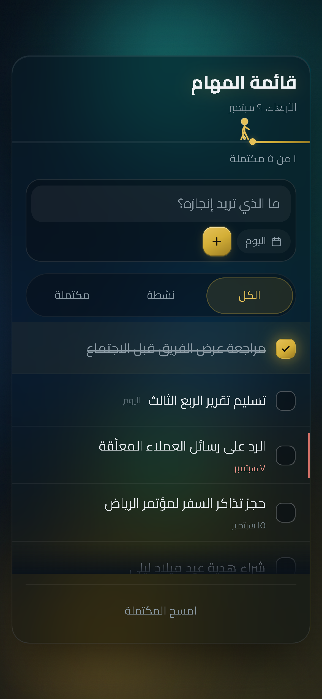

# قائمة المهام · Qa’imat Al-Mahaam

**A dark-luxury task list in Arabic — petrol ink, manuscript gold, and light that never stops moving.**

Not another grey to-do app. Every surface is deliberate: a deep petrol ground lit by a slow aurora of blended colour, a frosted glass card that the light refracts through, and warm gold reserved for the one thing that matters — progress. Built RTL-first for Arabic, mobile-first for the thumb, and with zero dependencies.

<!-- Drop a screenshot at docs/preview.png and uncomment:
<p align="center"></p>
-->

---

## Live Demo

**→ https://bassam-alhindi.github.io/ToDo-List/**

> Not live yet? Enable it in **Settings → Pages → Source: `main` / root**. The link goes live a minute later.

---

## The Design

### Dark Luxury — Petrol & Gold

The palette is a single deliberate pairing: a cool deep ground so the warm accent has something to sing against.

| Token | Value | Role |
|---|---|---|
| Ground | `#0a131a` → `#0d1b2a` | Deep midnight petrol ink |
| Accent | `#d4af37` · `#e5c158` | Warm manuscript gold — buttons, checks, active tab, progress |
| Alert | `#d9736a` | Muted terracotta, reserved for overdue and delete |
| Glass | `rgba(13, 21, 28, 0.58)` | Translucent panel over the moving light |

Gold appears **only** where something is achieved or actionable. Everything else stays quiet, so the eye goes where the work is.

### Fluid Motion

The background is a real ambient system, not a static gradient:

- A **rotating conic beam** (44s) sweeps teal → gold → blue light behind the card
- **Four blurred orbs** on `mix-blend-mode: screen` drift and morph on deliberately mismatched cycles — **14s / 17s / 21s / 25s** — so they fall in and out of phase and the pattern never visibly repeats
- Everything animates `transform` only, so it composites on the GPU instead of repainting

The glass panel sits above it with `backdrop-filter: blur(24px) saturate(180%)`, letting the colour bleed and glow through its edges.

### Typography

Two Arabic faces with clearly separate jobs — **Reem Kufi** for the geometric kufi wordmark, **IBM Plex Sans Arabic** for the interface. Letter-spacing is pinned to `normal` throughout, since spacing Arabic breaks the script's joins.

---

## Features

**Interactive composer** — One container holds the text field, the date pill, and the add button behind a single focus ring. New tasks default to **today**, so the common case needs no extra tap.

**Custom date picker** — The native `<input type="date">` is replaced entirely by a compact popover anchored to its pill. Saturday-first calendar, Arabic-Indic numerals (`٩ سبتمبر`), quick shortcuts for اليوم / غدًا / بعد أسبوع, and it flips above or below the pill depending on available room. The gold accent only lights up when you pick a date that *isn't* today.

**Context-aware actions** — The delete `×` stays hidden until the row is hovered, tapped, or focused, so the list reads clean at rest. Reveal is wired for pointer, touch, and keyboard independently.

**A completion worth watching** — Checking a task runs a staggered cascade rather than one snap: the box fills, the checkmark draws itself, the strikethrough sweeps across, then the text dims — each starting while the last is still moving. A gold spark burst and pulse ring land on top. Measured at a locked **60fps**, zero dropped frames.

**Live progress** — A hairline rule beneath the header fills right-to-left with a glowing head, plus a running `٣ من ٨ مكتملة` count that switches to `اكتمل كل شيء` when you're done.

**Filters that glide** — All / Active / Completed, with an indicator that springs between tabs and rows that re-enter staggered.

**Compact by design** — The card never runs off the screen. The list alone scrolls under a capped height, with a custom gold scrollbar and a fade at each edge that appears only when there's more content past it.

**Full persistence** — Everything lives in `localStorage`; nothing leaves the device. No account, no backend, no tracking.

**Mobile-first** — Designed at the phone and scaled up, not shrunk down:

- Every control is a **44px** touch target (the checkbox keeps a 24px mark inside a 44px tap area)
- Inputs are **16px**, below which iOS force-zooms the page on focus
- Safe-area insets respected via `viewport-fit=cover`
- Hover affordances sit behind `@media (hover: hover)` so touch devices never get stuck hover states

**Accessible** — `prefers-reduced-motion` stops the aurora, the beam, and the spark burst completely while leaving the app fully usable. Text contrast holds at **8.9:1 or better** even at the brightest point of the background cycle, comfortably past WCAG AAA.

---

## Tech Stack

Three files. No framework, no build step, no `node_modules`.

| | |
|---|---|
| **HTML5** | Semantic, `dir="rtl"`, ARIA roles for the dialog, progressbar and live regions |
| **CSS3** | `backdrop-filter`, `@keyframes`, custom properties, `mix-blend-mode`, `conic-gradient`, logical properties (`inset-inline-*`) for RTL, `clamp()` type scale |
| **Vanilla JavaScript** | ES6+, no dependencies. `Intl.DateTimeFormat` / `Intl.NumberFormat` for Arabic dates and numerals |
| **Fonts** | Reem Kufi + IBM Plex Sans Arabic via Google Fonts, with a system fallback stack |

```
ToDo-List/
├── index.html    # structure + ambient layer markup
├── style.css     # theme tokens, aurora, glass, layout, motion
└── script.js     # state, date picker, persistence, interactions
```

---

## Run Locally

No install, no build.

```bash
git clone https://github.com/Bassam-Alhindi/ToDo-List.git
cd ToDo-List
```

Then open `index.html` in your browser — that's genuinely it.

For a local server (recommended, so fonts and `localStorage` behave exactly as in production):

```bash
python -m http.server 8000     # → http://localhost:8000
```

```bash
npx serve .                    # if you prefer Node
```

**Browser support:** any modern browser. `backdrop-filter`, `mix-blend-mode` and `conic-gradient` are required for the full effect — Chrome/Edge 76+, Safari 9+, Firefox 103+. In older browsers the app degrades to a flat dark theme and stays fully functional.

---

## Notes

- The interface is **Arabic and RTL** throughout. The layout is built on CSS logical properties, so the mirroring is structural rather than bolted on.
- The aurora is the most expensive part of the page — four blurred orbs and a large conic gradient under a `saturate(180%)` backdrop filter. It's transform-only and composites well, but on older phones you can lighten it by removing `.beam` or reducing the orb `blur()` radii in `style.css`.
